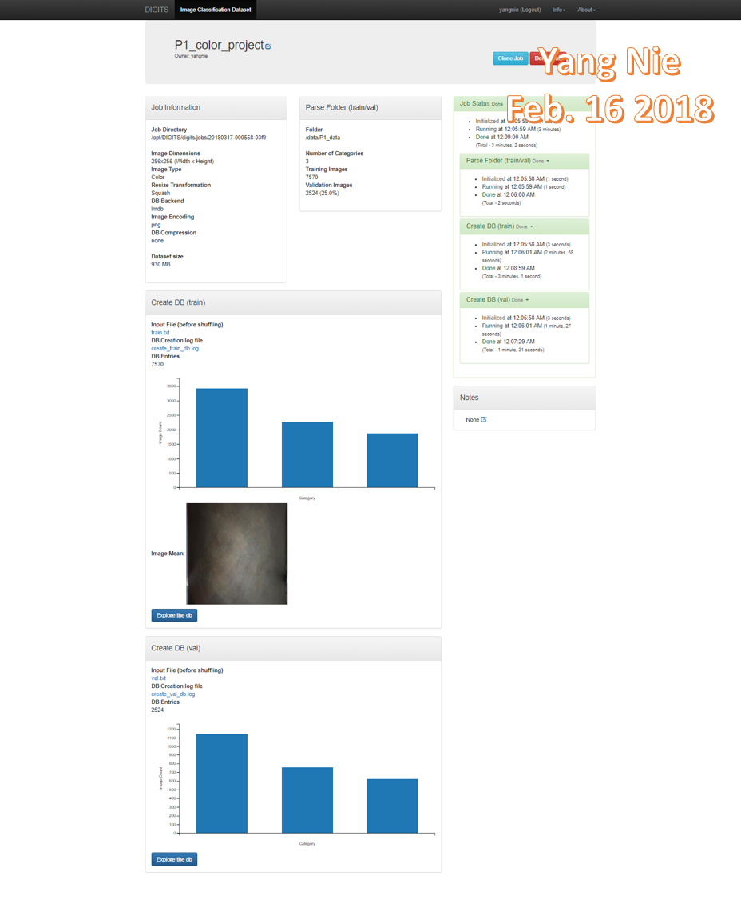
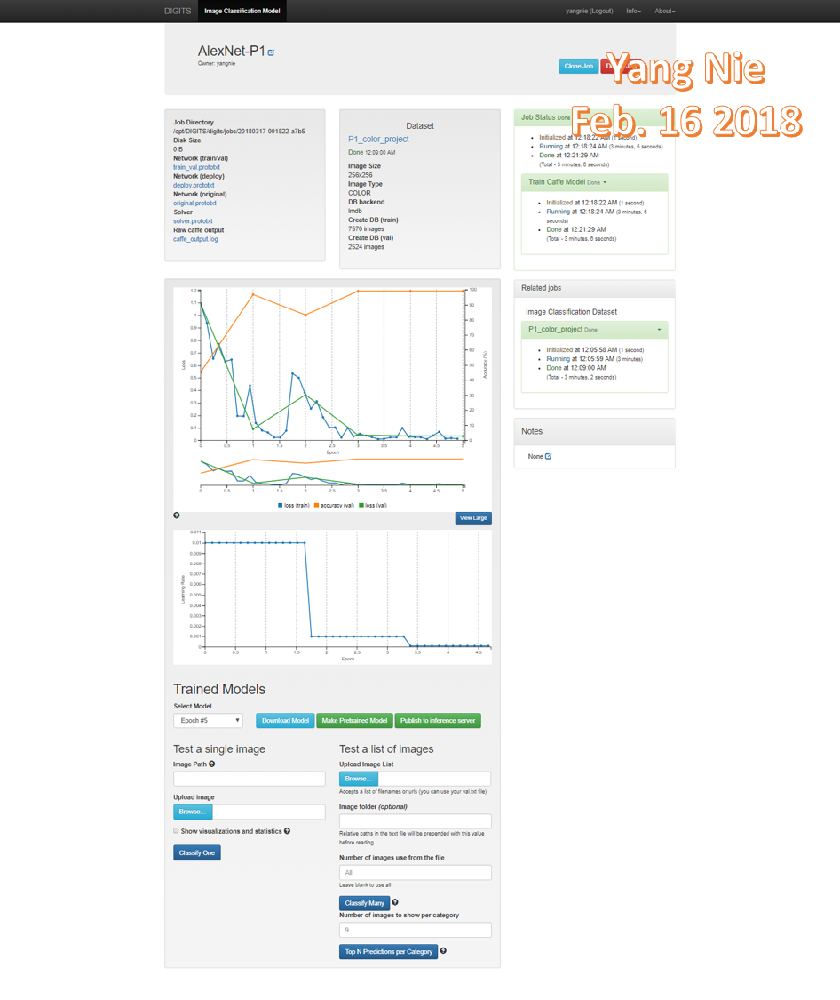
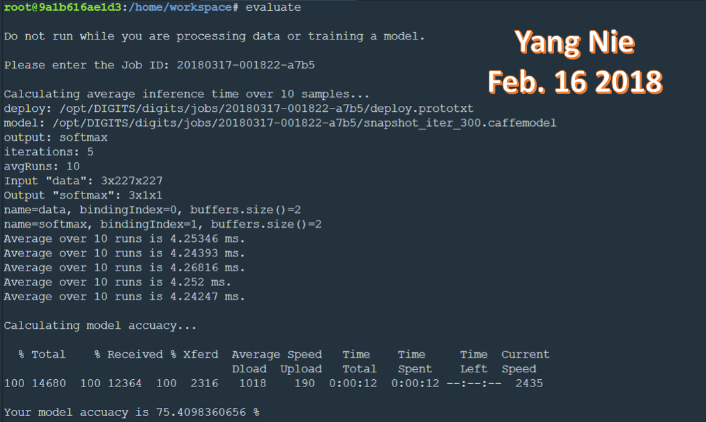
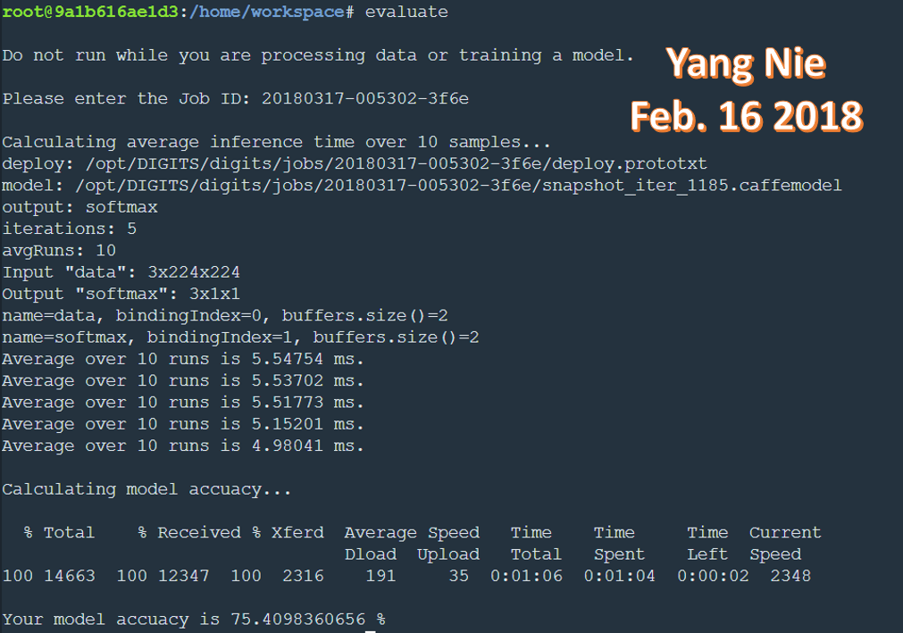

## Udacity Term 2 Robotic Inference Project

### Abstract

This project has two classification data models using Deep Neural Network technology. The first one is classifying the bottles, candy wrappers and nothing on a moving belt. The second one classified the human face to identify male, female or nothing. The image data are come from public dataset. The project used the three model: AlexNet, GoogLeNet and LeNet. For both classifications, the best results were presented in this article.

### Introduction 

Classification includes a broad range of decision-theoretic approaches to the identification of images (or parts thereof). All classification algorithms are based on the assumption that the image in question depicts one or more features (*e.g.*, geometric parts in the case of a manufacturing classification system, or spectral regions in the case of remote sensing) and that each of these features belongs to one of several distinct and exclusive classes. The classes may be specified *a priori* by an analyst (as in *supervised classification*) or automatically clustered (*i.e.* as in *unsupervised classification*) into sets of prototype classes, where the analyst merely specifies the number of desired categories[1].

In this project used NVIDIA’s DIGITS workflow to rapidly prototype ideas that can be deployed on the Jetson in close to real time. The DIGITS will prototype classification networks, detection networks, segmentation networks!

There are two parts in the project:

1. P1 moving belt image classification part used P1 dataset pictures of candy boxes, bottles, and nothing (empty conveyor belt).
2. Human face classification part used human face dataset from .... 

### Background / Formulation

#### 1. P1 moving belt image classification

​         The P1 image dataset is stored in /data/P1/ directory. It include all images of bottles, candy wrappers and no object on a conveyor belt passing under a camera. A swing arm is used to sort all right objects to correct the bins depending on classifying results. 

P1 dataset image example:

  

P1 dataset was split two training and validation parts, the image size is 256 X 256

##### Data Acquisition:
The P1 dataset are split to two sets: training and validation dataset. They are color image and size is 256 x 256. This dataset is provided from Udacity robotics class.

##### Model creation:

AlexNet Model was built as:

GoogLeNet Model was built as:

#### 2. Human face classification 

### Results

#### 1. P1 moving belt image classification

Evaluating result for AlexNet Model  as:

Evaluating result for GoogLeNet Model  as:

Both AlexNet and GoogLeNet models are at least 75 percent accuracy and an inference time of less than 10 ms.

|         |    AlexNet     |   GoogLeNet    |
| :-----: | :------------: | :------------: |
| Accuacy | 75.4090360656% | 75.4090360656% |
| Average inference Time | 4.254004 ms | 5.34768 ms |

#### 2. Human face classification 

### Discussion

### Conclusion / Future Work

### References

[1] S. Perkins, A. Walker and E. Wolfart, Classification "https://homepages.inf.ed.ac.uk/rbf/HIPR2/classify.htm" 2003

