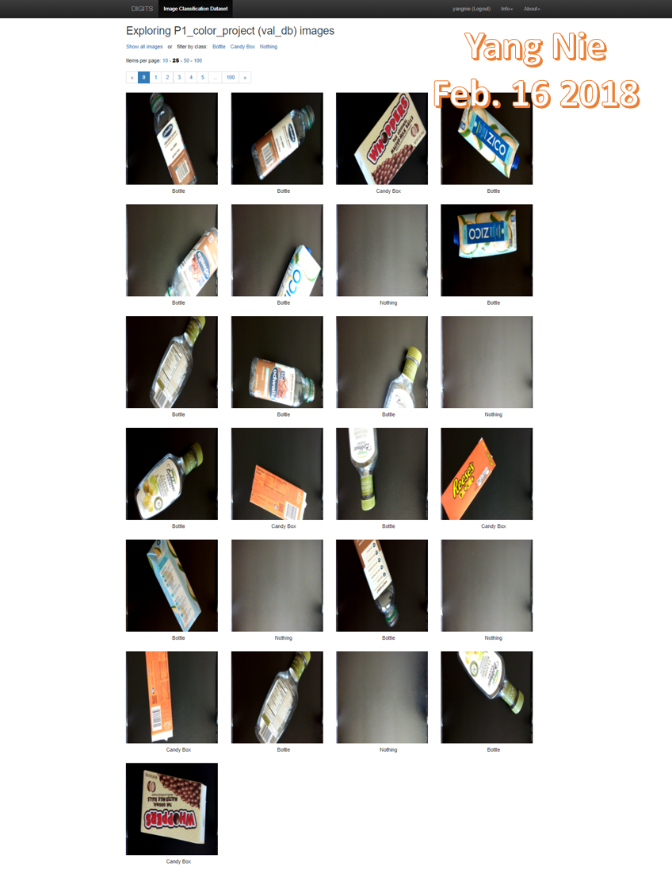
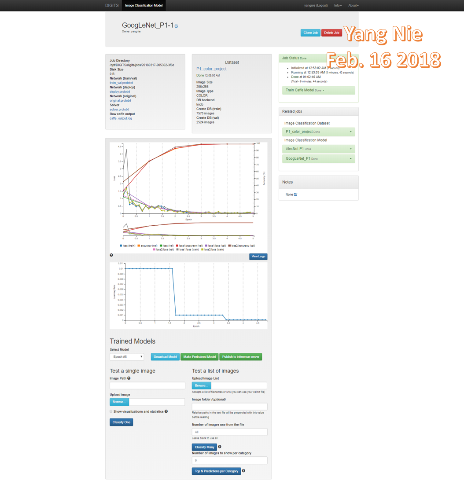
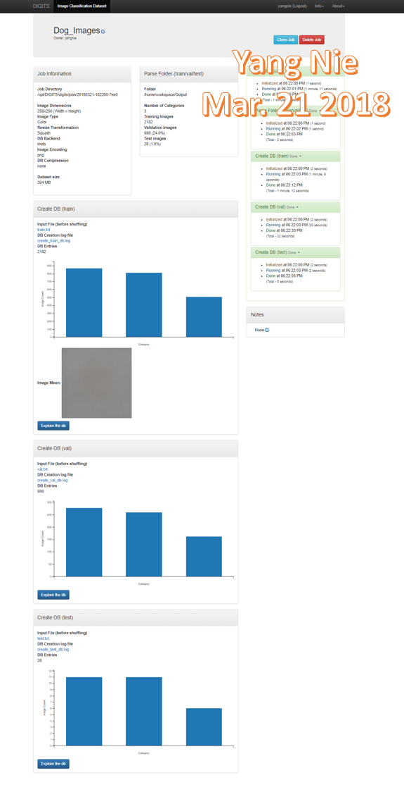
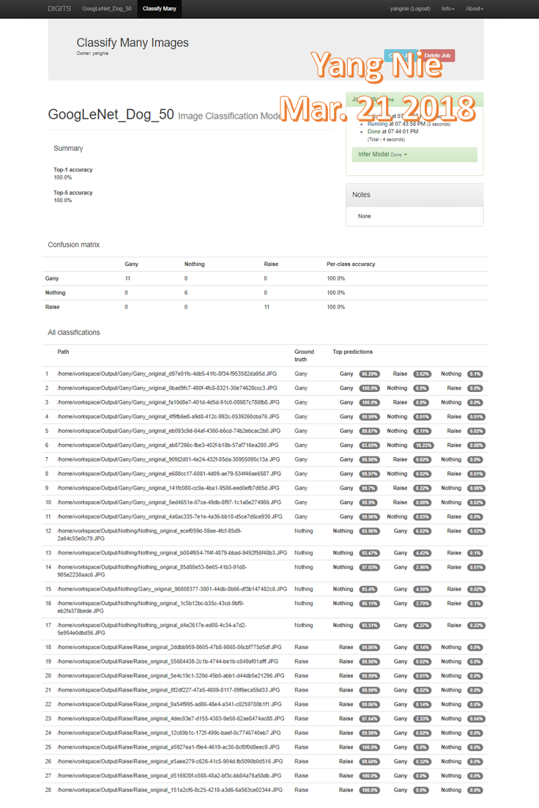

## Udacity Term 2 Robotic Inference Project

### Abstract

This project has two classification data models using Deep Neural Network technology. The first one is classifying the bottles, candy wrappers and nothing on a moving belt. The second one classified the dog A, dog B or nothing. The image data are come from public dataset. The project used the three model: AlexNet, GoogLeNet and LeNet. For both classifications, the best results were presented in this article.

### Introduction 

Classification includes a broad range of decision-theoretic approaches to the identification of images (or parts thereof). All classification algorithms are based on the assumption that the image in question depicts one or more features (*e.g.*, geometric parts in the case of a manufacturing classification system, or spectral regions in the case of remote sensing) and that each of these features belongs to one of several distinct and exclusive classes. The classes may be specified *a priori* by an analyst (as in *supervised classification*) or automatically clustered (*i.e.* as in *unsupervised classification*) into sets of prototype classes, where the analyst merely specifies the number of desired categories[1].

In this project used NVIDIA’s DIGITS workflow[2] to rapidly prototype ideas that can be deployed on the Jetson in close to real time. The DIGITS will prototype classification networks, detection networks, segmentation networks!

There are two parts in the project:

1. P1 moving belt image classification part used P1 dataset pictures of candy boxes, bottles, and nothing (empty conveyor belt).
2. Dog image classification part used the dog image dataset (dog A, dog B and nothing) which Author collected  from iPhone.

### Background / Formulation

#### 1. P1 moving belt image classification

​         The P1 image dataset is stored in /data/P1/ directory. It include all images of bottles, candy wrappers and no object on a conveyor belt passing under a camera. A swing arm is used to sort all right objects to correct the bins depending on classifying results. 

P1 dataset image example:

  

P1 dataset was split two training and validation parts, the color image size is 256 X 256

##### Data Acquisition:
The P1 dataset is provided from Udacity Robotics lesson.

It were split to two sets: training and validation dataset. They are color image and size is 256 x 256. This dataset is provided from Udacity robotics class.

##### Model creation:

AlexNet Model was built as:

GoogLeNet Model was built as:

##### The parameter setting:  

Both epoch were set to 5. All other parameters used as default.

#### 2. Dog image classification 

The dog image files located in Output folder, it includes three subfolders, Gany for dog A, Raise for dog B, Nothing for no object.

Dog image example:

Dog image dataset was split three training, validation and test parts, the color image size is 256 X 256

##### Data Acquisition:

The dog images were taken from iPhone, then used Augmentation[3] code to generate 500 to 1000 additional images depend the object type.

|              | Dog A (Dany) | Dog B (Raise) | No object (Nothing) |
| ------------ | :----------: | :-----------: | :-----------------: |
| iPhone images | 193 | 156 | 62 |
| Augment generated images | 887 | 998 | 612 |
| Total images  | 1080 | 1154 | 674 |

The dog database was created as:

|              | Training | Validating | Testing |
| ------------ | :----------: | :-----------: | :-----------------: |
| Image number | 2185 | 695 | 28 |
| Percentage | 75% | 24% | 1% |

##### Model creation:

GoogLeNet Model was created as : (Use default GoogLeNet network, no change in model itself)

##### The parameter setting:

Both epoch were set to 50 and Batch size = 50. All other parameters used as default.

### Results

#### 1. P1 moving belt image classification

Evaluating result for AlexNet Model  as:

Evaluating result for GoogLeNet Model  as:

Both AlexNet and GoogLeNet models are at least 75 percent accuracy and an inference time of less than 10 ms.

|         |    AlexNet     |   GoogLeNet    |
| :-----: | :------------: | :------------: |
| Accuacy | 75.4090360656% | 75.4090360656% |
| Average inference Time | 4.254004 ms | 5.34768 ms |

#### 2. Dog image classification 

AlexNet and GoogLeNet models, both were built and tested. Compare both of them, the GoogLeNet model has better results. This article only shows GoogLeNet model result.

This is GoogLeNet model results (epoch = 50, batch size = 50): The result is very good, the accuracy for  all three classes are 100%.

Note:  The number in table is the number of image:

|              | Dog A (Gany) | Dog B (Raise) | No object (Nothing) | Per-class accuracy |
| :----------- | :----------: | :-----------: | :-----------------: | :----------------: |
| Dog A (Gany) |      11      |       0       |          0          |        100%        |
| Dog B (Raise) |      0      |       11       |          0          |        100%        |
| No object (Nothing) |      0      |       0       |          6          |        100%        |

Digits test results screen copy:

### Discussion

The original images are almost covering full dog body, using augment code can easily generate different angle and different part of dog body images. There is no problem to use rotate, flip and resize functions to generate new images, but crop image function can cause some image problems if the new image didn't include the target object at all. The image source quality is very important for Deep Learning training result, the manually checking was applying all these generated images to make sure no any nothing image mixed in dog image classes. 

To achieve the best result, the LeNet network was not used because only  28x28 image size and gray color can be used. But AlexNet and GoogLeNet, both networks support 256x256 color image.

Both AlexNet and GoogLeNet have been tested for classification of dog image,  GoogLeNet showed better accuracy than AlexNet at epoch = 20.  According to the research paper from Siddharth Das[4], GoogLeNet had a better performance than AlexNet.

CNNs Architectures:LeNet, AlexNet, VGG, GoogLeNet, ResNet comparing table:

So GoogLeNet was selected to continue training and testing. Set epoch at 5, 20, 30 and 50 to train the GoogLeNet network, the best result is at epoch = 50, Batch size = 50.

Changed batch size to 50, can reduce training time and use less memory.

### Conclusion 

Using augmentation code to generate image is a good and fast way to get a large number of image.

The result used GoogLeNet model (with epoch = 50, Batch size = 50 and test dataset = 1% of total images) and plus image augmented images are very satisfied in classification dog images (All three classes accuracy are 100%).  

### Future Work

1. Install Nvidia DIGITS system on local PC instead of using cloud resource, so there is no time limitation to implement and test different projects and models.
2.  Include testing object detection and segmentation implementation, and deploying the model on Jetson TX2 board and testing them in real world environment.

### References

[1] S. Perkins, A. Walker and E. Wolfart, Classification "https://homepages.inf.ed.ac.uk/rbf/HIPR2/classify.htm" 2003

[2] Nvidia, DIGITS workflow "https://developer.nvidia.com/digits" 2018

[3] Marcus D. Bloice, Augmentor "https://github.com/mdbloice/Augmentor" 2018

[4] Siddharth Das, CNNs Architectures:LeNet, AlexNet, VGG, GoogLeNet, ResNet and more …  "https://medium.com/@siddharthdas_32104/cnns-architectures-lenet-alexnet-vgg-googlenet-resnet-and-more-666091488df5" 2017